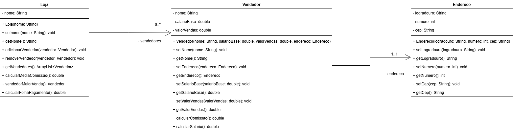

# Exercício: Sistema de Gestão de Vendedores

## 🎯 Objetivo
O objetivo desta atividade é implementar um sistema de gestão de vendedores, seguindo o diagrama de classes proposto. Os conteúdos desta atividade são:
* **Encapsulamento:** Proteção de atributos e uso de métodos de acesso.
* **Relação de multiplicidade:** Relacionamento entre objetos (*Mais de um*).
* **Coleções (`ArrayList`):** Manipulação dinâmica de arrays de objetos.
* **Tratamento de Exceções:** Validação de regras de negócio com `IllegalArgumentException`.

---

## 🏗️ Estrutura do Projeto

### 1. Diagrama de classe

Implemente o diagrama de classes abaixo seguindo o encapsulamento, bem como os relacionamentos entre as classes

#### 1. Classe `Endereco`
Representa o endereço do vendedor.
* **Regras de Validação:**
    * Todos os campos de texto são obrigatórios (não podem ser nulo ou em branco).
    * O `numero` deve ser maior que zero.
    * Caso as regras falhem, lance uma `IllegalArgumentException`.

#### 2. Classe `Vendedor`
Representa os dados individuais e financeiros do vendedor.

* **Regras de Validação:**
    * `nome` e `endereco` não podem ser nulos ou em branco.
    * `salarioBase` deve ser no mínimo **R$ 1.412,00**.
    * `valorVendas` não pode ser negativo.
    * Caso as regras falhem, lance uma `IllegalArgumentException`.
* **Métodos:**
    * `calcularComissao()`: Retorna 10% do valor de vendas.
    * `calcularSalario()`: Retorna a soma do salário base com a comissão.

#### 3. Classe `Loja`
Classe responsável por gerenciar o conjunto de vendedores.
* **Regras de Validação:**
    * `nome` não pode ser nulo ou em branco.
    * Caso as regras falhem, lance uma `IllegalArgumentException`.
* **Métodos Obrigatórios:**
    * `adicionarVendedor(Vendedor v)`: Adiciona um vendedor à lista. 
        * **Validação:** Validar se o vendedor for nulo, lance `IllegalArgumentException`
    * `removerVendedor(Vendedor v)`: Remove um vendedor da lista.
        * **Validação:** Se a lista estiver vazia ou o vendedor for nulo, lance `IllegalArgumentException`.
    * `getVendedores()`: Retorna a lista de todos os vendedores.
    * `calcularMediaComissao()`: Retorna a média das comissões de todos os vendedores da loja.
    * `vendedorMaiorVenda()`: Retorna o vendedor com o maior valor de vendas.
    * `calcularFolhaPagamento()`: Retorna o custo total da loja com salários (Soma de todos os salários totais).

#### 4. Mensagens de erro
As mensagens de erro nas validações devem seguir o seguinte formato "Campo invalido", exemplo "Cidade invalida" e "Nome invalido". As mensagens de erro serão validades desta maneira
